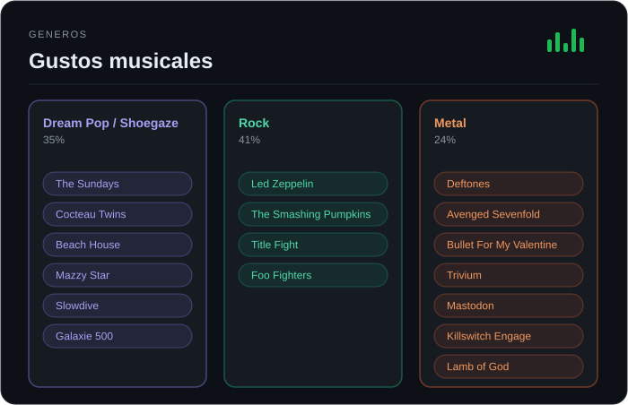

<div align="center">


</div>

<br>

```
Description : Estudiante de Ing. Informática — 3er año
Age          : 20
Host         : Chile
Kernel       : Aprendo construyendo, no solo leyendo teoría

Languages.Programming : JavaScript (en profundidad), TypeScript, Java
Languages.Real         : Español (nativo)
```

## 🌱 Sobre mí

Hola, soy Cristian 👋 — apasionado por la música, y la programación es a lo que más le dedico mi tiempo. Estudiante de Ingeniería en Informática en Chile, construyendo una base sólida en JavaScript y TypeScript junto a React antes de saltar a más frameworks. Tengo experiencia práctica construyendo proyectos completos, programando y decidiendo la arquitectura yo mismo.

```javascript
const cristian = {
  conoce: ["JavaScript", "HTML", "CSS", "Tailwind", "Bootstrap", "Figma", "Java", "C#", "MySQL", "PostgreSQL", "Supabase"],
  aplicado_en_proyectos: ["React", "TypeScript", "Node.js", "Docker"],
  ruta: ["AWS/Cloud", "Java avanzado", "Spring Boot", "Kubernetes", "CI/CD", "Linux"]
};
```

<br>

## 💻 Proyectos destacados

**[music-social](https://github.com/seggovia/music-social)** — Red social para obsesivos de la música, con mensajería nativa en vez de solo reseñas y ratings. Búsqueda de usuarios por gustos similares/opuestos, integración con MusicBrainz y Last.fm, base de datos en Supabase con Row-Level Security.
`React` `TypeScript` `Node.js` `Supabase (PostgreSQL)`

**[school-intranet-system](https://github.com/seggovia/school-intranet-system)** — Plataforma de gestión académica institucional: notas, asistencia, comunicados, horarios con FullCalendar, notificaciones en tiempo real (SSE) y generación de boletines en PDF.
`React` `TypeScript` `Node.js` `Prisma` `MySQL`

**Otros proyectos:**
- 🎮 Videojuego 2D en Unity, con historia propia (~8 min de duración)
- 📱 App de gestión para una organización real — desarrollada dos veces como proyecto de ramo, en versión Web y versión Android

<br>

## 🎧 Fuera del código

Cuando no estoy programando, seguro estoy escuchando algo — 3000+ álbumes en mi RYM y contando. Vivo en algún punto entre el shoegaze/dream pop, el rock clásico y el metal.



<div align="center">

[](https://rateyourmusic.com/~MrTulita)
[](https://open.spotify.com/user/31es2wcwlvzakj5lgdakjdqmw5um)

</div>

<div align="center">

<!-- Spotify Now Playing -->
<a href="https://github.com/kittinan/spotify-github-profile">

</a>

<br><br>

<!-- Spotify Recently Played -->
<a href="https://open.spotify.com/user/31es2wcwlvzakj5lgdakjdqmw5um">

</a>

</div>

<br>

## 📊 GitHub Stats

<div align="center">


</div>

<div align="center">

<!-- GitHub Contribution Snake — requiere configurar un GitHub Action, ver instrucciones abajo -->


</div>

<br>

<div align="center">

</div>
